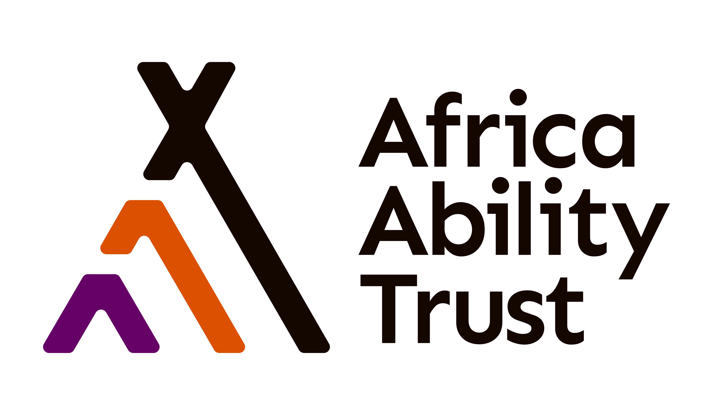

<!-- HEADER HERO -->

  

<!-- ANIMATED INTRO -->

  

---

## 💡 About Me
I’m building a strong base in **Python, HTML/CSS, and JavaScript** on my journey to becoming an **AI Engineer** — crafting **inclusive, data-driven solutions** that solve real-world problems.  
  
🌐 Co-executive director of [AfricaAbility.org](https://www.africaability.org)

---

## 🛠 Skills Cloud
**💡 Skills:** 🐍 Python | 🌐 HTML | 🎨 CSS | ⚡ JavaScript | 🛡 Cybersecurity | 🗄 MySQL

---

## 🚀 Tech Stack

  
  
  
  
  

---

## 📚 Learning Progress

  
  
  
  
  

---

## 📊 GitHub Stats
<table align="center" width="100%">
  <tr>
    <td align="center" width="50%">
      
    </td>
    <td align="center" width="50%">
      
    </td>
  </tr>
</table>

  

---

## 📈 GitHub Activity Graph

---

## 📌 Featured Projects

  
  

---

## 🏆 Achievements & Milestones
- 🎓 Joined **Power Learn Project** Scholarship  
- 🖥 Completed **HTML/CSS Fundamentals**  
- 🤖 Started **AI & Data Annotation** work in 2019  

---

## 📅 Learning Roadmap

  
Click to Expand

- Finish HTML/CSS fundamentals  
- Advance JavaScript skills  
- Python for AI (NumPy, Pandas)  
- Intro to Machine Learning (scikit-learn)  
- Cybersecurity foundations  

---

## 📬 Connect

  
  

